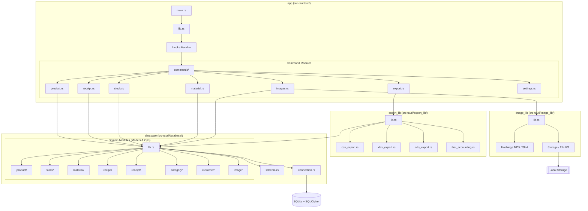

# Backend Deep Dive: Modular Architecture

This document provides a granular view of the Rust backend, detailing the internal structure of each crate and module.

### Module Responsibilities

| Crate / Module | Responsibility |
| :--- | :--- |
| **`app::commands`** | Validates frontend input and routes requests to underlying libraries. |
| **`database::connection`** | Manages the encrypted SQLCipher connection pool. |
| **`database::schema`** | Diesel-generated schema for compile-time query safety. |
| **`database::<domain>`** | Contains `models.rs` (structs) and `operations.rs` (CRUD functions) for each entity. |
| **`export_lib`** | Handles multi-format data generation and Thai tax reporting logic. |
| **`image_lib`** | Manages unique image storage using file hashing to prevent duplicates. |

### Technical Details
- **Encryption**: AES-256 via SQLCipher at the database layer.
- **ORM**: Diesel (configured with `returning_clauses_for_sqlite_3_35`).
- **Reports**: Uses `rust-xlsxwriter` for Excel and standard CSV crates for basic exports.
