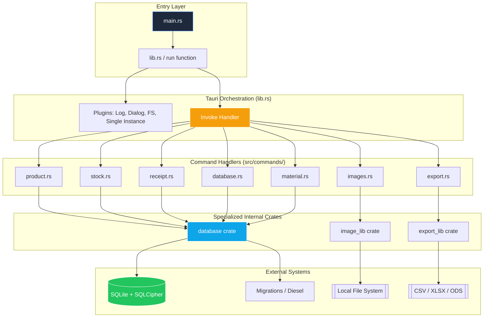

# Backend Architecture

```mermaid
graph TD
    %% Entry Layer
    subgraph "Entry Layer"
        MN[main.rs] --> LIB[lib.rs / run function]
    end

    %% Orchestration Layer
    subgraph "Tauri Orchestration (lib.rs)"
        LIB --> PLG[Plugins: Log, Dialog, FS, Single Instance]
        LIB --> IH[Invoke Handler]
    end

    %% Command Interface Layer
    subgraph "Command Handlers (src/commands/)"
        IH --> CM_P[product.rs]
        IH --> CM_S[stock.rs]
        IH --> CM_R[receipt.rs]
        IH --> CM_D[database.rs]
        IH --> CM_E[export.rs]
        IH --> CM_I[images.rs]
        IH --> CM_M[material.rs]
    end

    %% Business Logic / Service Layer
    subgraph "Specialized Internal Crates"
        CM_P & CM_S & CM_R & CM_D & CM_M --> DB_C[database crate]
        CM_E --> EX_C[export_lib crate]
        CM_I --> IM_C[image_lib crate]
    end

    %% Data / System Layer
    subgraph "External Systems"
        DB_C --> SQL[(SQLite + SQLCipher)]
        DB_C --> MIG[Migrations / Diesel]
        IM_C --> FS[[Local File System]]
        EX_C --> DOC[[CSV / XLSX / ODS]]
    end

    %% Styling
    style MN fill:#1e293b,stroke:#3b82f6,color:#fff
    style IH fill:#f59e0b,stroke:#fff,color:#fff
    style DB_C fill:#0ea5e9,stroke:#fff,color:#fff
    style SQL fill:#22c55e,stroke:#fff,color:#fff
```
