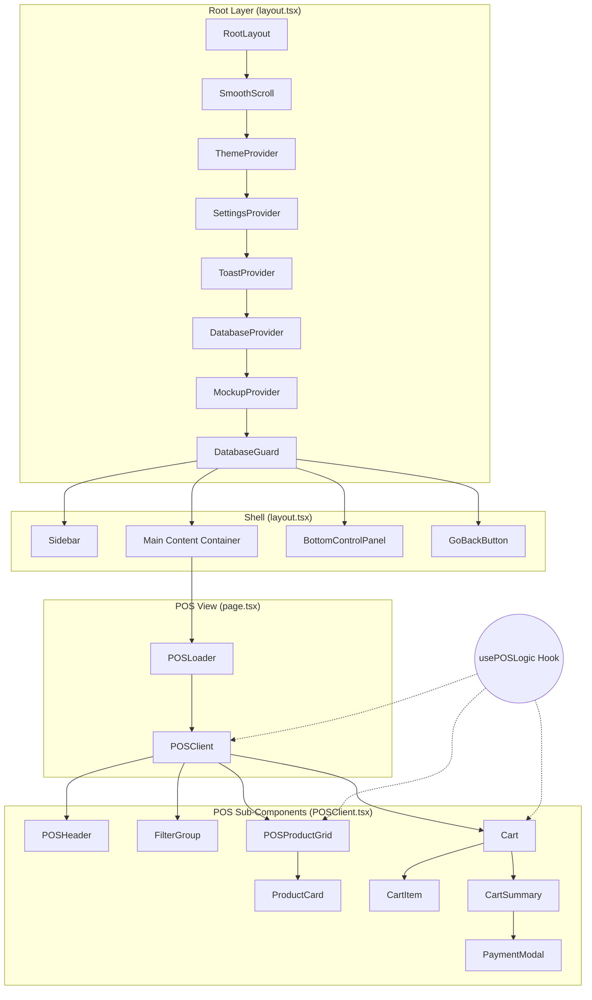

# Component Hierarchy

```mermaid
graph TD
    %% Global Level
    subgraph "Root Layer (layout.tsx)"
        RL[RootLayout] --> SS[SmoothScroll]
        SS --> TP[ThemeProvider]
        TP --> SP[SettingsProvider]
        SP --> TSP[ToastProvider]
        TSP --> DP[DatabaseProvider]
        DP --> MP[MockupProvider]
        MP --> DG[DatabaseGuard]
    end

    %% UI Shell
    subgraph "Shell (layout.tsx)"
        DG --> SB[Sidebar]
        DG --> MN[Main Content Container]
        DG --> BCP[BottomControlPanel]
        DG --> GBB[GoBackButton]
    end

    %% Page Specific (page.tsx)
    subgraph "POS View (page.tsx)"
        MN --> PL[POSLoader]
        PL --> PC[POSClient]
    end

    %% POS Sub-Components
    subgraph "POS Sub-Components (POSClient.tsx)"
        PC --> PH[POSHeader]
        PC --> FG[FilterGroup]
        PC --> PPG[POSProductGrid]
        PC --> CT[Cart]
        
        PPG --> PCA[ProductCard]
        CT --> CI[CartItem]
        CT --> CS[CartSummary]
        CS --> PM[PaymentModal]
    end

    %% Data Connections
    usePOSLogic((usePOSLogic Hook)) -.-> PC
    usePOSLogic -.-> CT
    usePOSLogic -.-> PPG
```
