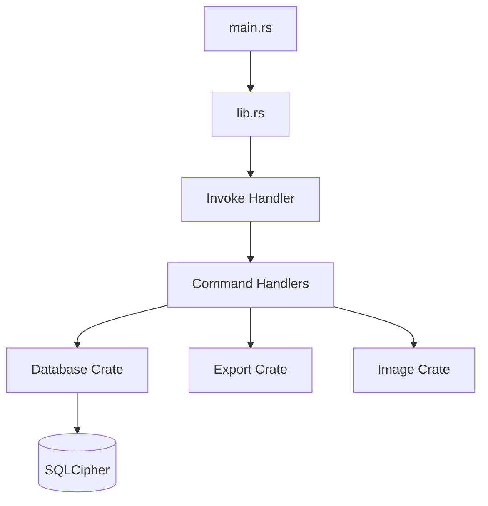
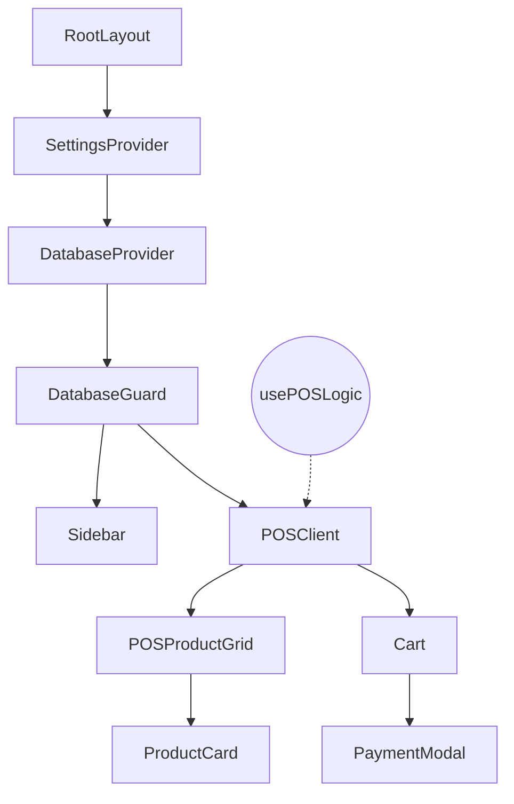

# GEMINI.md - Vibe POS (Simple POS)

## Project Overview
Vibe POS is a professional, modern, and lightweight Point of Sale (POS) system built with **Tauri v2** and **Next.js 16**. It is a local-first desktop application designed for high performance and security, featuring an encrypted database and a highly customizable touch-optimized UI.

### Core Technologies
- **Backend**: Rust, Tauri 2.x, Diesel ORM, SQLite with **SQLCipher** (AES-256 encryption).
- **Frontend**: Next.js 16 (App Router, React 19), TypeScript, Tailwind CSS 4.
- **Database**: Local encrypted SQLite database using `sqlcipher`. Data is stored in platform-specific app data directories (e.g., `~/.local/share/simple-pos` on Linux).
- **Testing**: WebdriverIO for E2E testing with `tauri-driver`.

---

## Building and Running

### Development
Starts both the Next.js development server (with Turbopack) and the Tauri application window.
```bash
npm run tauri dev
```
*Note: On Linux, this script automatically sets `WEBKIT_DISABLE_DMABUF_RENDERER=1` to prevent rendering issues.*

### Production Build
Generates a standalone executable for the current operating system.
```bash
npm run tauri build
```
Output binaries are located in `src-tauri/target/release/bundle/`.

### Linting and Testing
```bash
npm run lint        # Runs ESLint
npm run test:e2e    # Runs WebdriverIO E2E tests
```

---

## Architecture and Data Flow

### Backend Structure (`src-tauri/`)
- **`src-tauri/src/commands/`**: Contains the Tauri commands exposed to the frontend, organized by module (product, stock, receipt, etc.).
- **`src-tauri/database/`**: Local crate for database interactions, Diesel models, and migrations.
- **`src-tauri/export_lib/`**: Local crate for handling data exports (CSV, XLSX, ODS).
- **`src-tauri/image_lib/`**: Local crate for image processing and storage.

#### Backend Architecture


### Frontend Structure (`src/`)
- **App Router**: Uses Next.js 16 App Router (`src/app/`).
- **Context Providers**: Found in `src/context/`, managing global state for Settings, Database (auth/connection), Toasts, and Mockup mode.
- **API Layer**: `src/lib/api/` wraps Tauri `invoke` calls. Most API calls require a `dbKey` from the `DatabaseContext`.
- **UI Scaling**: Custom scaling logic (50%-200%) implemented via CSS custom properties managed by `SettingsContext`.

#### Component Hierarchy


### Data Flow
1. **Database Initialization**: User enters a key → `DatabaseProvider` initializes the encrypted SQLCipher connection.
2. **Settings**: Loaded from disk → `SettingsProvider` applies UI scales and themes.
3. **Transaction**: Cart managed by `usePOSLogic` hook → Payment creates an invoice → Backend deducts stock (directly or via recipes).

---

### AI Component Registry
We maintain a "yellow pages" registry of reusable components, hooks, and API functions in `.agents/ai-components.json`. 
Update it by running:
`npm run registry`
AI agents should check this file first when looking for existing functionality.

### Backend (Rust)
- **API Compatibility**: Always verify that changes in the Rust backend align with the frontend API calls in `src/lib/api/`.
- **SQLCipher**: The `.db` file is encrypted. Do not attempt to read it directly without SQLCipher support.
- **Data Paths**: Use the platform-specific local data directory for storage.
- **Logging**: Use `log::info!()` and run with `RUST_LOG=debug` for troubleshooting.

### Frontend (React/Next.js)
- **Component Reuse**: Prioritize using global components from `src/components/ui/` or `src/components/common/`.
- **CSS Standards**: Avoid hardcoded CSS values. Use Tailwind CSS and global styles in `src/app/globals.css`.
- **Code Splitting**: Keep files focused. Split logic into dedicated components, hooks, or utility libraries.
- **Types**: Always define and update shared types in `src/lib/types/`.

### Database Migrations
- Use Diesel CLI: `diesel migration generate <name>`.
- Implement SQL in `src-tauri/database/migrations/`.

---

## Key Files
- `CLAUDE.md`: Detailed project guidelines and command references.
- `package.json`: Frontend dependencies and scripts.
- `src-tauri/Cargo.toml`: Backend dependencies.
- `src-tauri/tauri.conf.json`: Tauri configuration (capabilities, plugins, window settings).
- `.agents/rules/`: Project-specific AI rules for backend and component development.
