# Vibe POS (Simple POS)

A professional, modern, and lightweight Point of Sale (POS) system built with **Tauri v2** and **Next.js 16**, designed for high performance, security, and simplicity.

## Features

- **Point of Sale Interface**: Fast and intuitive interface for processing sales with optimized touch support.
- **Advanced Inventory Management**:
  - **Product Management**: Detailed product tracking with categories and images.
  - **Material & Recipe Management (New)**: Track raw materials and define recipes for complex items (e.g., drinks, food).
  - **Real-time Stock Tracking**: Monitor inventory levels with low-stock alerts.
- **Customer Management (New)**: Track customer information and purchase history.
- **Checkout & Payment**:
  - **Virtual Numpad**: Optimized touchscreen numeric keypad for quick cash entry.
  - **Smart Change Calculation**: Automated change display with validity checks.
  - **Receipt Generation**: Backend integration for secure transaction recording.
- **Customizable UI & Design Mode**:
  - **Global Display Scaling**: Adjust the entire interface size from 50% to 200%.
  - **WYSIWYG Editor**: Interactive mode to adjust layout scaling and component sizes in real-time.
  - **Responsive Layout**: Optimized for various resolutions (1080x720 up to 4K).
- **Order History**: 
  - Comprehensive view of past transactions with filters and search.
- **Security & Privacy**:
  - **Encrypted Database**: Local data is protected via **SQLCipher** (AES-256 encryption).
  - **Local-First**: Your data stays on your machine.

## Tech Stack

- **Frontend**: [Next.js 16](https://nextjs.org/) (React 19), [Tailwind CSS 4](https://tailwindcss.com/)
- **Backend**: [Tauri v2](https://v2.tauri.app/) (Rust)
- **Database**: SQLite with **SQLCipher** (via Diesel ORM in Rust)
  - **Automatic Path Resolution**: Uses `directories` crate to store data securely in the system's local data directory (e.g., `~/.local/share/simple-pos` on Linux).
- **State Management**: React Hooks & Context
- **Performance**:
  - **Turbopack**: Fast builds and HMR.
  - **Code Splitting**: Next.js App Router for optimal load times.
  - **Memoization**: `React.memo` and `useCallback` to minimize re-renders.

## Prerequisites

Before you begin, ensure you have the following installed:

- **Node.js** (v24 or newer recommended)
- **Rust & Cargo** (latest stable)
- **System Dependencies**:
  - **Linux**: Build essentials, webkit2gtk (see [Tauri Linux Setup](https://v2.tauri.app/start/prerequisites/#linux))
  - **macOS**: Build your own , i don't have mac.
  - **Windows**:
    - Microsoft Visual Studio C++ Build Tools
    - **OpenSSL**: Required for database encryption (`sqlcipher`). Set `OPENSSL_DIR` and `OPENSSL_LIB_DIR` environment variables.

## Setup & Development

1. **Clone the repository**
   ```bash
   git clone <repository-url>
   cd simple-pos
   ```

2. **Install dependencies**
   ```bash
   npm install
   ```

3. **Run in Development Mode**
   This command starts both the Next.js frontend and the Tauri application window.
   ```bash
   npm run tauri dev
   ```
   > **Note for Linux Users**: The `tauri` script in `package.json` automatically sets `WEBKIT_DISABLE_DMABUF_RENDERER=1` to prevent rendering issues. Using `npm run tauri dev` ensures this is applied.

## Building for Production

To build a standalone executable for your operating system:

```bash
npm run tauri build
```

The output binary will be located in `src-tauri/target/release/bundle/`.


## Troubleshooting

### Linux (NVIDIA GPUs)
If you experience rendering issues, blank screens, or crashes on Linux with an NVIDIA GPU, you may need to disable the DMABUF renderer.

Run the application with the following environment variable:
```bash
WEBKIT_DISABLE_DMABUF_RENDERER=1 ./simple-pos
```
or add it to your profile/environment variables.

## Architecture



## Project Structure

- **`src/`**: Next.js frontend source code.
  - `app/`: Application routes and pages (`page.tsx`, `layout.tsx`).
    - `about/`: About page.
    - `history/`: Order history page.
    - `manage/`: Management interface.
      - `categories/`: Category management.
      - `stock/`: Stock management.
    - `mockup/`: Mockup data interface.
    - `setting/`: Settings section.
      - `general/`: General settings.
      - `theme/`: Appearance settings.
      - `display/`: Display scaling.
      - `currency/`: Currency configuration.
      - `tax/`: Tax rules.
      - `export/`: Data export.
  - `components/`: Reusable React components (`cart`, `design-mode`, `filters`, `layout`, `payment`, `pos`, `ui`).
  - `context/`: Global state management (`DatabaseContext`, `SettingsContext`, `MockupContext`).
  - `hooks/`: Custom React hooks.
  - `lib/`: Utility functions and API wrappers (`api.ts`).
  - `types/`: Shared TypeScript definitions.
- **`src-tauri/`**: Rust backend source code.
  - `src/`: Core Rust source files (`main.rs`, `lib.rs`, `commands/`).
  - `database/`: Local crate for database interactions.
  - `export_lib/`: Local crate for handling exports.
  - `capabilities/`: Tauri permission capabilities.
  - `icons/`: Application icons.
  - `tauri.conf.json`: Tauri configuration file.
