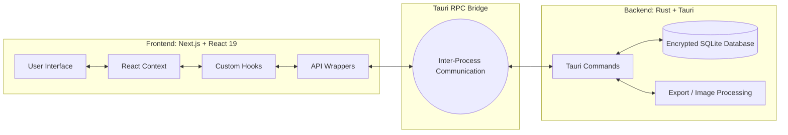
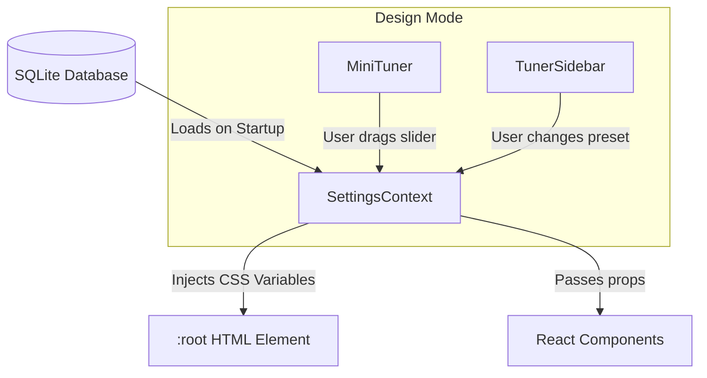
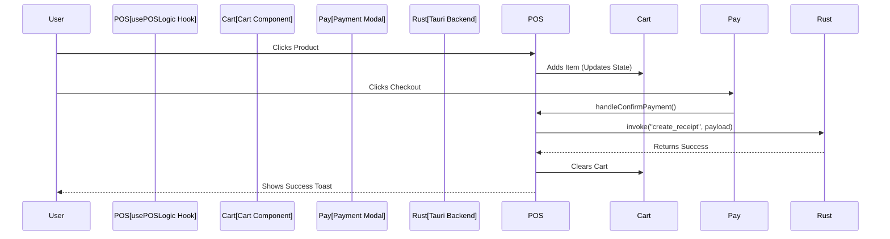
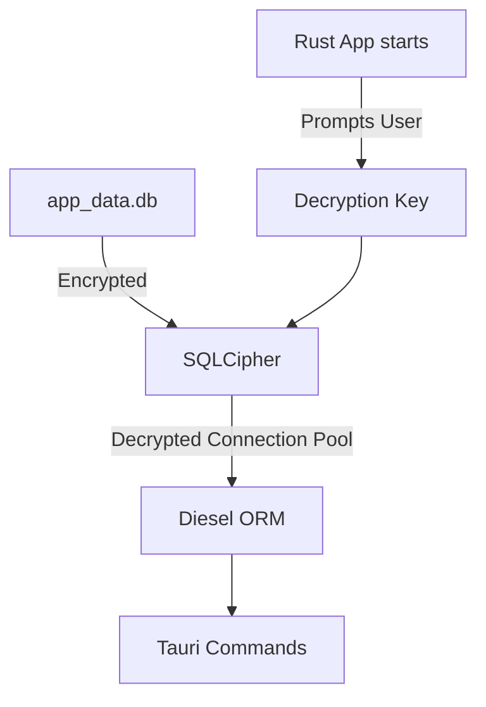

# 📖 Vibe POS (Simple POS) - Complete Guide & Manual

Welcome to **Vibe POS**! This guide is designed to help developers, designers, and contributors understand exactly how this project works, from the high-level architecture down to the granular UI tuning system.

---

## 🏗️ 1. High-Level Architecture

Vibe POS is a **Local-First Desktop Application**. It doesn't rely on the cloud for its core operations, making it blazing fast and highly secure.

It is built using the **Tauri Framework**, which splits the application into two distinct halves:



*   **The Frontend (Webview):** Built with Next.js 16, React 19, and Tailwind CSS. It handles everything the user sees and touches.
*   **The Backend (Core):** Built with Rust. It handles heavy lifting, secure data storage, file system access, and peripheral hardware (if any).
*   **The Bridge:** The frontend talks to the backend exclusively by passing JSON messages back and forth through Tauri Commands.

---

## 🎨 2. The Design Tuner & UI System

One of the most powerful features of Vibe POS is its **Design Mode**. Instead of hardcoding sizes and colors, the application uses a dynamic tuning system.

### How Styling Flows Through the App:



1.  **`SettingsContext` (`src/context/settings/SettingsContext.tsx`):** The beating heart of the UI. It holds the `AppSettings` object (containing values like `grid_scale`, `numpad_button_height`, `theme_primary_color`).
2.  **CSS Variable Injection:** When the app loads, `SettingsContext` converts theme colors and border radiuses into raw CSS variables (`--primary`, `--radius`) and injects them directly into the document root. Tailwind CSS picks these up automatically.
3.  **Real-Time Tuning:** When you open the Design Tuner, components like the `MiniTuner` and `TunerSidebar` allow you to change these values live. They use GPU-accelerated dragging (`react-draggable`) to feel native.

### Making Components Tunable

To make a component selectable in Design Mode, it must be wrapped with a `SelectableOverlay` and sized dynamically:

```tsx
// Example of a tunable component
<div style={{ transform: `scale(${settings.my_component_scale / 100})` }}>
  <SelectableOverlay id="my_component_scale" />
  <MyActualComponent />
</div>
```

---

## 🛒 3. The POS Engine (Business Logic)

The core cash register logic lives entirely in the frontend, managed by a custom hook called `usePOSLogic`.



*   **`src/hooks/usePOSLogic.tsx`**: This hook takes the raw product list and manages the `cartItems` array. It handles math (subtotals, tax rates) and orchestrates the checkout flow.
*   **The Payment Flow:** Once the user inputs cash in the `VirtualNumpad` and confirms, the frontend gathers the cart array and calls the API wrapper (`src/lib/api/receipts.ts`), which bridges over to Rust.

---

## 🔒 4. The Encrypted Database

Vibe POS takes security seriously. The SQLite database is encrypted at rest using **SQLCipher** (AES-256).



*   **Diesel ORM (`src-tauri/database/`):** The Rust backend uses Diesel to interact with the database safely. It uses strongly typed models (`models.rs`) that map directly to the database schema (`schema.rs`).
*   **Transactions:** When a receipt is created, Rust handles the entire process (saving the receipt, saving the line items, and deducting inventory from the `stock` table) in a single atomic database transaction.

---

## 🤖 5. The AI Component Registry (Yellowpages)

To help AI assistants (like the Gemini CLI) navigate the codebase instantly, we maintain an automated component registry.

*   **What it is:** `.agents/ai-components.json` is a searchable index of every component, hook, and API in the project.
*   **How it works:** It stores file paths, export names, descriptions, and auto-generated keywords (e.g., "cart", "scale", "database").
*   **How to update it:** Run `npm run registry`. A script will scan the codebase and rebuild the index in seconds.

---

## 🛠️ 6. Quick Reference Commands

| Command | Action |
| :--- | :--- |
| `npm run tauri dev` | Starts the Next.js frontend (Turbopack) and the Tauri desktop window for development. |
| `npm run tauri build` | Compiles everything into a standalone executable (e.g., `.exe` or `.app`). |
| `npm run lint` | Runs ESLint to check for code quality and TypeScript errors. |
| `npm run test:e2e` | Runs automated UI tests using WebdriverIO and the Tauri driver. |
| `npm run registry` | Updates the AI Yellowpages component registry. |

---

*This manual was generated to provide a clear, visual understanding of the Vibe POS architecture and workflows.*