# Tauri Backend Architecture

This directory contains the Rust backend for the Vibe POS application, built with Tauri v2. It provides a secure, performant bridge between the frontend and the local system.

## Architecture

## Structure

- **`src/`**: Core Rust source files (`main.rs`, `lib.rs`, `commands/`).
- **`database/`**: Local crate for database interactions (Diesel ORM + SQLCipher).
- **`export_lib/`**: Local crate for handling data exports.
- **`image_lib/`**: Local crate for image processing and storage.
- **`tauri.conf.json`**: Tauri configuration file.

## Security

The backend uses **SQLCipher** to provide transparent 256-bit AES encryption for the SQLite database. This ensures that even if the `.db` file is accessed directly, the data remains protected.

## Key Commands

The backend exposes several command modules to the frontend:

- **Product & Stock**:
  - `get_products`, `create_product`, `update_product`, `delete_product`
  - `get_stock`, `get_all_stocks`, `insert_stock`, `update_stock`, `remove_stock`
- **Transactions & Invoices**:
  - `create_invoice`: Create a new sale record.
  - `get_invoices_by_date`, `get_invoice_detail`: Retrieve order history.
- **Customer Management**:
  - `get_customers`, `create_customer`, `update_customer`, `delete_customer`
- **Material & Recipe**:
  - `get_materials`, `update_material`, `delete_material`
  - `get_recipes`, `create_recipe`, `update_recipe`, `delete_recipe` (Automates stock deduction based on ingredients)
- **Categories**:
  - `get_categories`, `create_category`, `update_category`, `delete_category`
- **Images**:
  - `save_image`: Save uploaded image to local storage.
  - `link_product_image`, `unlink_product_image`: Manage product-image relationships.
- **Settings**:
  - `get_settings`, `save_settings`: Manage application settings (persisted to `settings.json` in user data directory).
- **Export**:
  - `export_receipts`: Export transaction data to CSV/Excel/ODS.
- **System**:
  - `initialize_database`, `check_database_exists`
